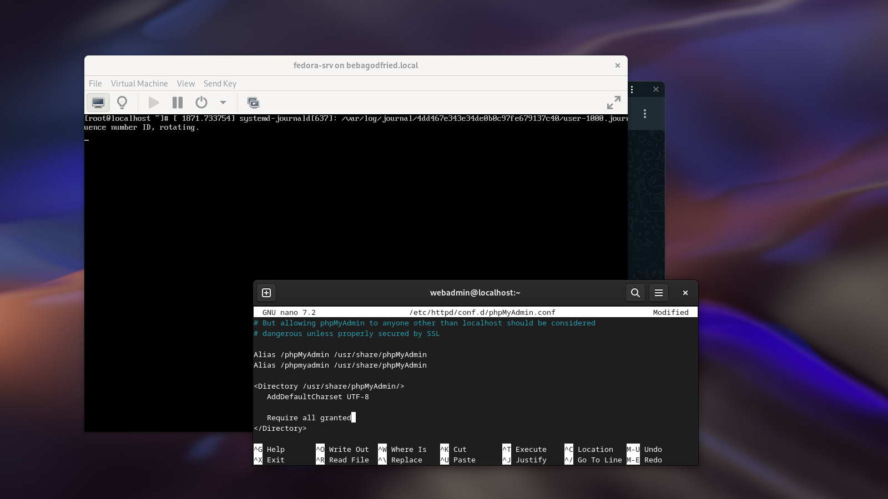

Step 1: Install Apache Web Server
- sudo dnf install httpd
```
================================================
Installing:
 httpd

Installing dependencies:
 apr
 apr-util
 fedora-logos-httpd
 httpd-core
 httpd-filesystem
 httpd-tools

Installing weak dependencies:
 apr-util-bdb
 apr-util-openssl
 julietaula-montserrat-fonts
 mod_http2
 mod_lua

================================================
 Transaction Summary
 12 Packages | size: 10 Mo
```

- Accept importing GPG key

- Start and enable apache server
```
 sudo systemctl start httpd
 sudo systemctl enable httpd
```
- Load ```LAMPP NG``` Config file
```
 sudo nano /etc/httpd/conf.d/lampp.conf

 ---
 <Directory "/var/www/html">
    Options Indexes FollowSymLinks
    AllowOverride All
    Require all granted
 </Directory>
```

- Then verify httpd service is running properly:
```
 sudo systemctl status httpd 
```
---

Step 2: Install MariaDB Database Server
- sudo dnf install mariadb-server 

```
================================================
Installing:
 mariadb-server

Installing dependencies:
 mariadb
 mariadb-common
 mariadb-connector-c
 mariadb-connector-c-config
 mariadb-errmsg
 mysql-selinux
 perl-AutoLoader
 perl-B
 perl-Carp
 perl-Class-Struct
 perl-DBD-MariaDB
 perl-DBI
 perl-Data-Dumper
 perl-Digest
 perl-Digest-MD5
 perl-DynaLoader
 perl-Encode
 perl-Errno
 perl-Exporter
 perl-Fcntl
 perl-File-Basename
 perl-File-Copy
 perl-File-Path
 perl-File-Temp
 perl-File-stat
 perl-FileHandle
 perl-Getopt-Long
 perl-Getopt-Std
 perl-HTTP-Tiny
 perl-IO
 perl-IO-Socket-IP
 perl-IO-Socket-SSL
 perl-IPC-Open3
 perl-MIME-Base64
 perl-Math-BigInt
 perl-Math-BigRat
 perl-Math-Complex
 perl-Mozilla-CA
 perl-Net-SSLeay
 perl-POSIX
 perl-PathTools
 perl-Pod-Escapes
 perl-Pod-Perldoc
 perl-Pod-Simple
 perl-Pod-Usage
 perl-Scalar-List-Utils
 perl-SelectSaver
 perl-Socket
 perl-Storable
 perl-Symbol
 perl-Sys-Hostname
 perl-Term-ANSIColor
 perl-Term-Cap
 perl-Text-ParseWords
 perl-Text-Tabs+Wrap
 perl-Time-Local
 perl-URI
 perl-base
 perl-constant
 perl-if
 perl-interpreter
 perl-libnet
 perl-libs
 perl-locale
 perl-mro
 perl-overload
 perl-overloading
 perl-parent
 perl-podlators
 perl-vars

Installing weak dependencies: 
 mariadb-backup
 mariadb-cracklib-password-check
 mariadb-gssapi-server
 mariadb-server-utils
 perl-NDBM_File


================================================
 Transaction Summary
 76 Packages | size: 145 Mo
```

- Start and enable mariadb server
```
 sudo systemctl start mariadb
 sudo systemctl enable mariadb
```

Step 3: Secure MySQL Installation
```
 sudo mysql_secure_installation 
```
---
```
NOTE: RUNNING ALL PARTS OF THIS SCRIPT IS RECOMMENDED FOR ALL MariaDB
      SERVERS IN PRODUCTION USE!  PLEASE READ EACH STEP CAREFULLY!

In order to log into MariaDB to secure it, we'll need the current
password for the root user. If you've just installed MariaDB, and
haven't set the root password yet, you should just press enter here.

Enter current password for root (enter for none): 
OK, successfully used password, moving on...

Setting the root password or using the unix_socket ensures that nobody
can log into the MariaDB root user without the proper authorisation.

You already have your root account protected, so you can safely answer 'n'.

Switch to unix_socket authentication [Y/n] 
Enabled successfully!
Reloading privilege tables..
 ... Success!


You already have your root account protected, so you can safely answer 'n'.

Change the root password? [Y/n] 
New password: 
Re-enter new password: 
Password updated successfully!
Reloading privilege tables..
 ... Success!


By default, a MariaDB installation has an anonymous user, allowing anyone
to log into MariaDB without having to have a user account created for
them.  This is intended only for testing, and to make the installation
go a bit smoother.  You should remove them before moving into a
production environment.

Remove anonymous users? [Y/n] 
 ... Success!

Normally, root should only be allowed to connect from 'localhost'.  This
ensures that someone cannot guess at the root password from the network.

Disallow root login remotely? [Y/n] 
 ... Success!

By default, MariaDB comes with a database named 'test' that anyone can
access.  This is also intended only for testing, and should be removed
before moving into a production environment.

Remove test database and access to it? [Y/n] 
 - Dropping test database...
 ... Success!
 - Removing privileges on test database...
 ... Success!

Reloading the privilege tables will ensure that all changes made so far
will take effect immediately.

Reload privilege tables now? [Y/n] 
 ... Success!

Cleaning up...

All done!  If you've completed all of the above steps, your MariaDB
installation should now be secure.

Thanks for using MariaDB!

```
---

Now check the MariaDB service status.
```
 sudo systemctl status mariadb
```

Step 4: Install PHP
- sudo dnf install php php-common php-mysqlnd 

```
================================================
Installing:
 php
 php-mysqlnd

Installing dependencies:
 libsodium
 nginx-filesystem
 php-common
 php-pdo

Installing weak dependencies:
 php-cli
 php-fpm
 php-mbstring
 php-opcache
 php-sodium
 php-xml

================================================
 Transaction Summary
 12 Packages | size: 55 Mo
```

then install modules -> [28 Packages | size: 39 Mo]
```
 sudo dnf install php-json php-gd php-cgi httpd-tools mod_ssl
```

php version: ```php -v```

---
Step 5: Add Firewall Rules
- Check if `'firewall-cmd'` command exist
```
 command -v firewall-cmd
```
---
```
 sudo firewall-cmd --add-service=http --permanent
 sudo firewall-cmd --add-service=https --permanent

 sudo systemctl reload firewalld 
```

- sudo systemctl restart httpd

Step 8: Test the LAMP Stack

Step 9: Installing phpMyAdmin on Fedora from Default Repository
```
 sudo dnf install phpmyadmin 
```

Step 10: Allow phpMyAdmin Access to Remote Hosts
```
 sudo nano /etc/httpd/conf.d/phpMyAdmin.conf
```



then
```sudo systemctl restart httpd ```

Step 11: File && Perrmissions
```
 sudo chmod -R 777 /var/www/html/
 sudo chmod -R 755 /var/www/html/*
```

Step 12: SSL
- activated by default


### Relax access to content within /var/www
- Check for ```/home/$USER/Public/``` path then
```
 mkdir /home/$USER/Public/
```
---
```
 ln -s /var/www/html/ /home/$USER/Public/htdocs
```

- Open or display url to server

!Option: add a personal host